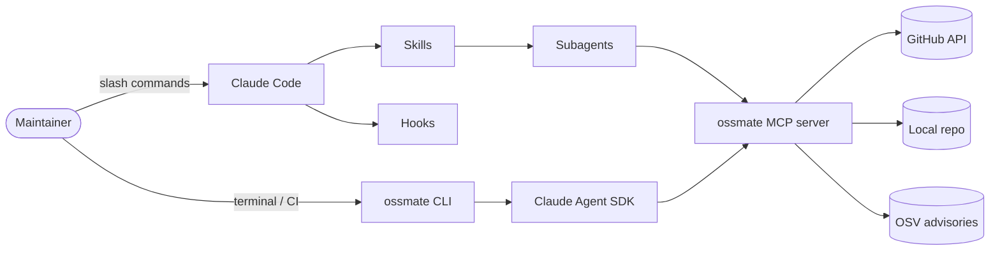

# Ossmate

**🇰🇷 한국어** · [🇬🇧 English](README.en.md)

[](https://github.com/sunjin12/ossmate/actions)
[](https://pypi.org/project/ossmate/)
[](https://github.com/sunjin12/ossmate)
[](https://www.python.org)
[](LICENSE)

> Claude 기반 오픈소스 메인테이너 보조 도구.

Ossmate는 OSS 메인테이너의 반복 업무 — PR 트리아지, 이슈 분류, 릴리스 노트 작성, 의존성 감사, stale 이슈 정리, 컨트리뷰터 온보딩 — 을 Claude Code 플러그인과 독립 CLI로 자동화합니다.

두 가지 목적으로 만들어졌습니다:

1. **실용 도구** — 이슈 큐에 빠져 죽는 솔로 메인테이너를 위한 진짜 도구.
2. **레퍼런스 구현체** — Claude Code의 *모든* 확장 표면(Skills, Subagents, Hooks, MCP, Plugins, Agent SDK, Cron, Status line, Output styles, Memory, Settings, Keybindings)을 하나의 일관된 제품으로 결합한 사례.

---

## 구축된 표면

| 표면 | 위치 | 상태 |
|---|---|---|
| Skills (슬래시 명령) | [.claude/commands/](.claude/commands/) | `[x]` Phase 5 (8/8) |
| Subagents | [.claude/agents/](.claude/agents/) | `[x]` Phase 5 (6개 — haiku/sonnet/opus 매칭) |
| Hooks | [.claude/hooks/](.claude/hooks/) | `[x]` Phase 3 (5개 이벤트, 21개 테스트) |
| MCP 서버 | [mcp/ossmate_mcp/](mcp/ossmate_mcp/) | `[x]` Phase 4 (11개 도구, 3개 템플릿) |
| 플러그인 패키징 | [.claude-plugin/](.claude-plugin/) | `[x]` Phase 6 (manifest + 자체 마켓플레이스) |
| Claude Agent SDK CLI | [cli/ossmate/](cli/ossmate/) | `[x]` Phase 7 (Typer + 8개 서브커맨드, dry-run 모드) |
| Status line | [.claude/statusline.sh](.claude/statusline.sh) | `[x]` Phase 1 |
| Output styles | [.claude/output-styles/](.claude/output-styles/) | `[x]` Phase 1 |
| Scheduled triggers | [scheduled/](scheduled/) | `[x]` Phase 8 (3개 cron 잡, off-minute 분산) |
| Memory templates | [.claude/CLAUDE.md](.claude/CLAUDE.md) | `[x]` Phase 0 |
| Settings & permissions | [.claude/settings.json](.claude/settings.json) | `[x]` Phase 0 |
| Keybindings | [.claude/keybindings.json.example](.claude/keybindings.json.example) | `[x]` Phase 1 |
| CI / Release | [.github/workflows/](.github/workflows/) | `[x]` Phase 9 (3-OS × 3-Python 매트릭스, OIDC PyPI 발행) |

---

## 빠른 시작

> 세 가지 사용 방법이 있습니다. 본인 환경에 맞는 것을 고르세요.

### A. Claude Code 플러그인 (권장)

```bash
claude plugin marketplace add https://raw.githubusercontent.com/sunjin12/ossmate/main/.claude-plugin/marketplace.json
claude plugin install ossmate@ossmate
```

설치 후 어느 repo에서나:

```
/triage-pr 1234
/release-notes v1.4.0
/stale-sweep --days 60
```

> 플러그인은 자체 네임스페이스를 가지므로 `/ossmate:triage-pr 1234` 형식도 작동합니다 — 다른 플러그인과 명령 이름이 충돌할 때 네임스페이스 형식을 쓰세요.

### B. 독립 CLI

```bash
pipx install ossmate
ossmate triage-pr 1234
ossmate release-notes v1.4.0
ossmate triage-pr 1234 --dry-run    # 렌더링된 prompt + ClaudeAgentOptions 출력
```

CLI는 플러그인이 사용하는 동일한 `.claude/commands/*.md` 스킬 본문을 로드합니다 — 스킬을 한 번 작성하면 슬래시 명령과 CLI 서브커맨드가 자동으로 함께 생깁니다.

설치 후 첫 명령이 실패한다면 `ossmate doctor`로 환경(Python, `gh` CLI 인증, MCP 서버, `.claude/`·`.ossmate/` 디렉터리)을 먼저 진단하세요. `--json` 플래그로 CI에서도 사용 가능합니다.

### C. 소스에서 (개발용)

```bash
git clone https://github.com/sunjin12/ossmate.git
cd ossmate
bash scripts/dev_link.sh        # mcp + cli editable 설치, --check 자동 실행
# Windows:
# powershell -ExecutionPolicy Bypass -File scripts/dev_link.ps1
pytest -q                       # 161개 hermetic 테스트, ~5초
```

---

## 아키텍처



같은 MCP 서버가 플러그인과 독립 CLI 양쪽을 모두 지원합니다 — 도구를 한 번 작성하면 어디서나 사용 가능.

---

## 왜 모든 표면을 사용했나?

12개 하네스 확장 각각이 OSS 메인테이너 도메인의 특정 마찰을 제거합니다. 단순 데모 매핑이 아닙니다 — 아래 표는 **각 표면이 없을 때 어떤 마찰이 생기는지**로 정당화합니다.

| 표면 | 없으면 발생할 마찰 |
|---|---|
| **Skills** (슬래시 명령) | 반복 워크플로(triage / release notes / stale sweep)를 매번 프롬프트 처음부터 작성 |
| **Subagents** | 모든 업무를 단일 모델로 — bulk 분류에 Opus, 보안 감사에 Haiku 같은 모델 미스매치 비용 |
| **Hooks** | `git push origin main` 실수 1건이 수 시간 복구 비용. 인간 의지력에만 의존 |
| **MCP 서버** | slash / CLI / 다른 AI 클라이언트가 gh · OSV · lockfile 파싱을 각자 재구현 |
| **플러그인 패키징** | 온보딩이 `pip install` + `.claude/` 복사 + settings 편집 다단계 |
| **Agent SDK CLI** | CI · 원격 shell · non-Claude-Code 환경에서 동일 워크플로 재구성 필요 |
| **Status line** | 현재 저장소의 PR 수 · stale 수가 매번 브라우저 탭으로만 확인 |
| **Output styles** | CHANGELOG의 Keep-a-Changelog 포맷 · 리뷰 tone을 매번 수동 교정 |
| **Scheduled triggers** | 의지력에 의존한 일간 체크 — 며칠 skip되면 악순환 |
| **Memory templates** | persona · 브랜치 보호 정책 · 커밋 컨벤션을 매 세션 다시 설명 |
| **Settings & permissions** | destructive `gh` 차단을 매번 훅으로만 방어 — 허용목록 baseline 없음 |
| **Keybindings** | 파워유저 전용 gesture 부재 (옵션 — 가장 낮은 가치) |

각 표면의 빌드 순서와 동기는 이 저장소의 PR 이력과 `phase-0` ~ `phase-9` 태그를 참조하세요.

---

## Self-dogfooding

이 저장소의 CHANGELOG는 Ossmate 자신이 생성하고, 스케줄된 트리거가 매일 이 repo에 다이제스트를 돌리며, PreToolUse 훅이 실수로 `main`에 force-push 하는 것을 막습니다. [CHANGELOG.md](CHANGELOG.md)를 참조하세요.

---

## 릴리스 방법

두 PyPI 프로젝트(`ossmate-mcp`, `ossmate`)는 함께 출시됩니다 — 버전 올리고, 태그 달고, push만 하면 GitHub Actions가 나머지를 처리합니다:

```bash
python scripts/bump_version.py 0.2.0   # 두 pyproject + plugin.json + marketplace.json 동시 갱신
python scripts/bump_version.py --check # invariant: 5곳 모두 일치 확인
git commit -am "chore(release): v0.2.0"
git tag v0.2.0 && git push --tags      # PreToolUse 훅이 명시적 승인 없이는 차단
```

릴리스 워크플로우는 태그 버전과 `pyproject.toml` 버전이 다르면 발행을 거부합니다. PyPI 업로드는 OIDC 신뢰 발행 방식 — 저장소 시크릿에 API 토큰이 없습니다.

---

## 개발 현황

단계별로 빌드되었습니다 — 계획은 [docs/project_phases.md](docs/project_phases.md)에 있습니다. 각 단계는 태그(`phase-0`, `phase-1`, …)로 마킹되어 있어 프로젝트의 진화 과정을 따라가볼 수 있습니다.

**v0.1.0 (2026-04-19)** — 첫 공개 릴리스. 모든 12개 표면 작동, PyPI 발행 완료.

---

## 라이선스

MIT — [LICENSE](LICENSE) 참조.
