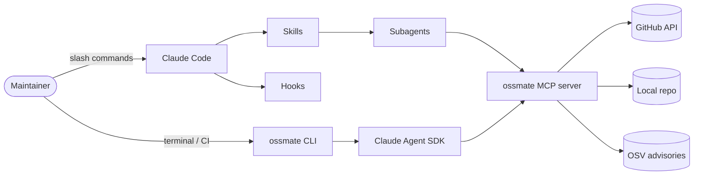

# Ossmate

[](https://github.com/sunjin12/ossmate/actions)
[](https://pypi.org/project/ossmate/)
[](https://github.com/sunjin12/ossmate)
[](https://www.python.org)
[](LICENSE)

> Your Claude-powered co-maintainer for open source.

Ossmate automates the repetitive parts of OSS maintenance — PR triage, issue classification, release notes, dependency audits, stale-issue sweeps, and contributor onboarding — through a Claude Code plugin and a standalone CLI.

It exists for two reasons:

1. **A practical tool** for solo maintainers drowning in their issue queue.
2. **A reference implementation** showing how to combine *every* Claude Code extension surface — Skills, Subagents, Hooks, MCP, Plugins, Agent SDK, Cron, Status line, Output styles, Memory, Settings, Keybindings — into a single coherent product.

---

## Built surfaces

| Surface | Where | Status |
|---|---|---|
| Skills (slash commands) | [.claude/commands/](.claude/commands/) | `[x]` Phase 5 (8/8) |
| Subagents | [.claude/agents/](.claude/agents/) | `[x]` Phase 5 (6 — haiku/sonnet/opus matched) |
| Hooks | [.claude/hooks/](.claude/hooks/) | `[x]` Phase 3 (5 events, 21 tests) |
| MCP server | [mcp/ossmate_mcp/](mcp/ossmate_mcp/) | `[x]` Phase 4 (11 tools, 3 templates) |
| Plugin packaging | [.claude-plugin/](.claude-plugin/) | `[ ]` Phase 6 |
| Claude Agent SDK CLI | [cli/ossmate/](cli/ossmate/) | `[ ]` Phase 7 |
| Status line | [.claude/statusline.sh](.claude/statusline.sh) | `[x]` Phase 1 |
| Output styles | [.claude/output-styles/](.claude/output-styles/) | `[x]` Phase 1 |
| Scheduled triggers | [scheduled/](scheduled/) | `[ ]` Phase 8 |
| Memory templates | [.claude/CLAUDE.md](.claude/CLAUDE.md) | `[x]` Phase 0 |
| Settings & permissions | [.claude/settings.json](.claude/settings.json) | `[x]` Phase 0 |
| Keybindings | [.claude/keybindings.json.example](.claude/keybindings.json.example) | `[x]` Phase 1 |

---

## Quickstart

> Three ways to use Ossmate. Pick the one that matches your environment.

### A. Claude Code Plugin (recommended)

```bash
claude plugin marketplace add https://raw.githubusercontent.com/sunjin12/ossmate/main/.claude-plugin/marketplace.json
claude plugin install ossmate@ossmate
```

Then inside any repo:

```
/triage-pr 1234
/release-notes v1.4.0
/stale-sweep --days 60
```

### B. Standalone CLI

```bash
pipx install ossmate
ossmate triage --since 24h
ossmate release-notes --tag v1.4.0
```

### C. From source (development)

```bash
git clone https://github.com/sunjin12/ossmate.git
cd ossmate
pip install -e ./mcp/ossmate_mcp ./cli/ossmate
bash scripts/dev_link.sh   # symlink .claude/ into project under test
```

---

## Architecture



The same MCP server backs both the plugin and the standalone CLI — write tools once, use them everywhere.

---

## Why each surface?

Ossmate uses every harness extension because the OSS-maintainer domain genuinely needs each one. This isn't a contrived demo — read [docs/architecture.md](docs/architecture.md) for the per-surface justification.

---

## Self-dogfooding

The CHANGELOG of this repo is generated by Ossmate itself, scheduled triggers run nightly digests on this very repo, and the PreToolUse hook protects `main` from accidental force-pushes. See [CHANGELOG.md](CHANGELOG.md).

---

## Development status

Currently building in phases — see [memory/project_phases.md](https://github.com/sunjin12/ossmate/blob/main/memory/project_phases.md) for the plan. Each phase is tagged (`phase-0`, `phase-1`, …) so you can browse the project's evolution.

---

## License

MIT — see [LICENSE](LICENSE).
